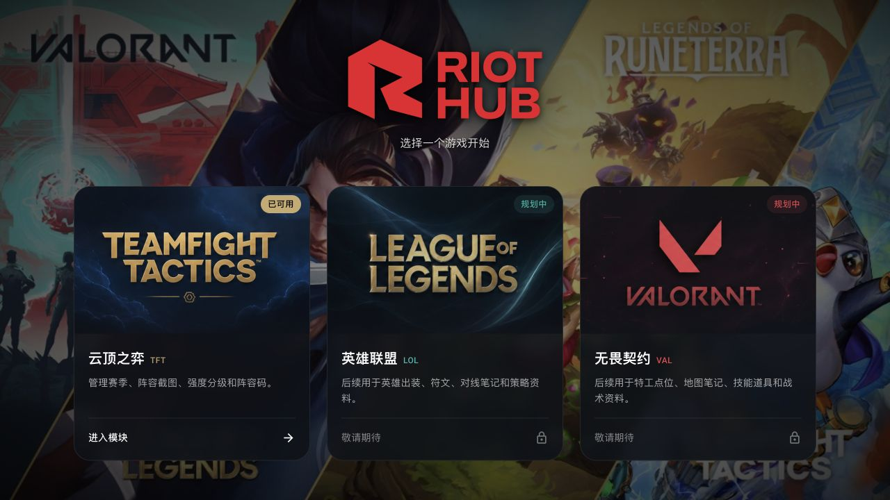
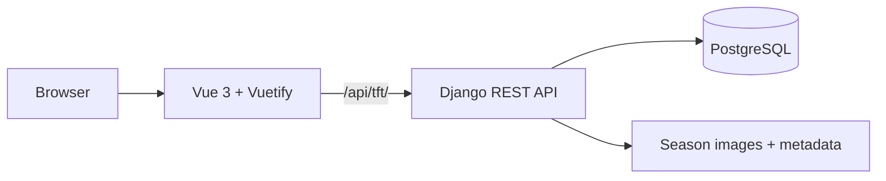

<div align="center">


### Your games. Your knowledge. One self-hosted hub.

Riot Hub turns team compositions, season references, and game knowledge into a<br />
focused workspace you own. Teamfight Tactics is available today, with League of
Legends and VALORANT designed to join the same modular platform.

<p>
  
  
  
  
  
</p>

[Explore the experience](#the-experience) · [Run with Docker](#quick-start) · [Architecture](#architecture) · [简体中文](docs/README.zh-CN.md)

</div>

---

<p align="center">
  
</p>

## One home for every Riot title

Riot Hub opens as a game-first launcher, then gives each title an independent
workspace. The current TFT module covers the complete flow from collecting a
composition to organizing and carrying it into a match—without spreading that
knowledge across folders, chat messages, and browser bookmarks.

| Discover | Organize | Maintain | Own |
| --- | --- | --- | --- |
| Browse a visual game hub and search compositions by name or keyword. | Arrange compositions on a persistent S / A / B drag-and-drop tier board. | Manage seasons, images, codes, tags, and per-season backgrounds in one interface. | Self-host the full stack and export or restore portable season metadata. |

## The experience

### A focused TFT workspace

- Switch seasons globally without leaving the current workflow.
- Browse composition artwork in a responsive viewer and copy team codes in one click.
- Search across filenames and custom keywords from the navigation drawer.
- Upload, edit, delete, refresh, and re-tier compositions from the settings center.
- Create seasons, choose the active season, and give each season its own background.

### Metadata that moves with your images

Each season can keep a `metadata.json` file beside its composition images. Riot Hub
syncs edits back to that file and supports validated export and restore from the UI.
The file contains portable fields such as composition code, tier, and keywords—not
database-generated IDs—so a season library remains understandable outside the app.

```json
{
  "schema_version": 1,
  "season": 17,
  "compositions": [
    {
      "filename": "duelist.png",
      "comp_code": "SET17-DUELIST",
      "tier_level": 0,
      "tier_display": "S",
      "keywords": ["fast 8", "reroll"]
    }
  ]
}
```

Import validates the JSON structure, season number, and referenced image files before
updating data. If synchronization fails, the previous metadata file is restored.

## Quick start

The shortest path to a production-like installation is Docker Compose.

```bash
cp .env.production.example .env
# Edit the secrets and host values in .env
docker compose up -d
```

Open `http://localhost:8080`. The stack exposes the frontend on `8080`, the API on
`8000`, and persists PostgreSQL and uploaded media under `./data/`.

### Local development

Requirements: Node.js 20+, Python 3.10+, and a reachable PostgreSQL instance.

```bash
# Terminal 1 — backend
cd backend
python -m venv .venv
source .venv/bin/activate        # Linux / macOS
# Windows PowerShell: .venv\Scripts\Activate.ps1
pip install -r requirements.txt
python manage.py migrate
python manage.py runserver 8000
```

```bash
# Terminal 2 — frontend
cd frontend
npm install
npm run dev
```

The Vite server runs at `http://localhost:3000` and proxies `/api` to the Django
server at `http://localhost:8000`.

| Frontend command | Purpose |
| --- | --- |
| `npm run dev` | Start the development server with HMR |
| `npm run build` | Create the production bundle in `frontend/dist` |
| `npm run preview` | Preview the production bundle locally |
| `npm run lint` | Run ESLint with auto-fix |

## Architecture

Riot Hub is a modular monolith: one frontend, one backend, and one database, shipped
through a single Compose file. Game boundaries live in code and naming rather than in
extra infrastructure.



Every game uses the same three-letter identifier across frontend routes, API prefixes,
Django apps, and database tables—for example `tft`, `/tft`, `/api/tft/`, and `tft_*`.
Game modules do not import or reference each other's models. Shared capabilities belong
in a one-way `common` layer when they are genuinely needed.

```text
riot-hub/
├── frontend/
│   └── src/
│       ├── components/hub/     Game cards and mobile card stack
│       ├── components/tft/     Viewer, dialogs, tier board, and settings
│       ├── pages/              Hub and game route trees
│       ├── layouts/            Hub and TFT application shells
│       └── stores/             Shared Pinia state
├── backend/
│   ├── config/                 Django project configuration
│   └── tft/                    Seasons and composition APIs
├── docs/                       Architecture and translated documentation
└── docker-compose.yml          Full-stack deployment
```

Read the [architecture document](docs/hub-refactor-architecture.md) for module rules,
namespace conventions, and the checklist for adding another game.

## API surface

The frontend uses Axios with `baseURL: '/api'`. The implemented TFT resources live
under `/api/tft/`.

| Resource | Core operations |
| --- | --- |
| `/api/tft/images/` | List, upload, edit, and delete composition images and metadata |
| `/api/tft/seasons/` | List and create seasons |
| `/api/tft/seasons/current/` | Read the active season |
| `/api/tft/seasons/:uid/set_active/` | Make a season active |
| `/api/tft/seasons/:uid/background/` | Upload, replace, or remove a season background |
| `/api/tft/seasons/:uid/import-compositions/` | Synchronize a season folder with the database |
| `/api/tft/seasons/:uid/composition-metadata/` | Export or restore a metadata JSON backup |

## Roadmap

- **League of Legends** — builds, runes, matchup notes, item sets, and strategy references.
- **VALORANT** — agent lineups, map notes, utility setups, and tactical resources.
- **Shared platform tools** — reusable search, upload, tagging, and organization primitives.

The launcher and namespace model are already in place; future titles can be added
without introducing another database, reverse proxy, or deployment stack.

## Deployment notes

The GitHub Actions workflow build-checks both Docker images on pull requests. Pushes to
`main` with build-relevant changes publish `latest` and the next patch version for:

- `${DOCKERHUB_NAMESPACE}/riot-hub-frontend`
- `${DOCKERHUB_NAMESPACE}/riot-hub-backend`

Configure `DOCKERHUB_USERNAME` and `DOCKERHUB_TOKEN` as repository secrets. An optional
`DOCKERHUB_NAMESPACE` repository variable overrides the image namespace. Documentation-
only changes skip image builds and publishing.

## License

This repository does not currently include a license. Add one before public distribution.
