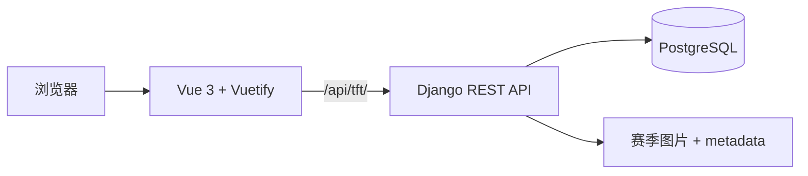

<div align="center">


### 你的游戏，你的知识，一个完全自托管的中心。

Riot Hub 将阵容、赛季资料和游戏知识整理成一个真正属于你的专注工作空间。<br />
云顶之弈现已可用，英雄联盟与无畏契约将沿用同一套模块化平台。

<p>
  
  
  
  
  
</p>

[体验亮点](#体验亮点) · [Docker 部署](#快速开始) · [系统架构](#系统架构) · [English](../README.md)

</div>

---

<p align="center">
  
</p>

## 一个入口，承载每一款 Riot 游戏

Riot Hub 以游戏启动中心作为入口，再为每款游戏提供彼此独立的工作空间。
当前 TFT 模块覆盖从收集阵容到整理、检索和实战使用的完整流程，让阵容知识
不再散落在文件夹、聊天记录和浏览器书签中。

| 发现 | 整理 | 维护 | 掌控 |
| --- | --- | --- | --- |
| 通过可视化游戏中心进入模块，按名称或关键词搜索阵容。 | 在 S / A / B 强度看板中拖拽调整阵容并持久保存。 | 在一个界面管理赛季、图片、阵容码、标签和赛季背景。 | 完整自托管，并可导出或恢复可迁移的赛季元数据。 |

## 体验亮点

### 专注的 TFT 工作空间

- 在顶部全局切换赛季，无需离开当前工作流。
- 通过响应式大图查看阵容，并一键复制阵容码。
- 从导航侧栏按文件名或自定义关键词搜索阵容。
- 在设置中心上传、编辑、删除、刷新阵容，或重新调整强度分级。
- 创建赛季、设置当前激活赛季，并为每个赛季配置专属背景。

### 与图片同行的元数据

每个赛季都可以在阵容图片旁维护一份 `metadata.json`。Riot Hub 会将界面中的
修改同步回文件，并支持经过校验的导出与恢复。文件只保存阵容码、强度和关键词
等可迁移字段，不保存数据库生成的 ID，因此离开应用后依然清晰可读。

```json
{
  "schema_version": 1,
  "season": 17,
  "compositions": [
    {
      "filename": "duelist.png",
      "comp_code": "SET17-DUELIST",
      "tier_level": 0,
      "tier_display": "S",
      "keywords": ["fast 8", "reroll"]
    }
  ]
}
```

导入前会校验 JSON 结构、赛季号和引用的图片文件。同步失败时，服务端会恢复
之前的 metadata 文件，避免留下半完成状态。

## 快速开始

通过 Docker Compose 可以最快获得一套接近生产环境的完整部署。

```bash
cp .env.production.example .env
# 编辑 .env 中的密钥与域名配置
docker compose up -d
```

打开 `http://localhost:8080`。前端使用 `8080` 端口，后端 API 使用 `8000`
端口，PostgreSQL 数据与上传文件持久化在 `./data/` 下。

### 本地开发

环境要求：Node.js 20+、Python 3.10+，以及一个可访问的 PostgreSQL 实例。

```bash
# 终端 1 — 后端
cd backend
python -m venv .venv
source .venv/bin/activate        # Linux / macOS
# Windows PowerShell: .venv\Scripts\Activate.ps1
pip install -r requirements.txt
python manage.py migrate
python manage.py runserver 8000
```

```bash
# 终端 2 — 前端
cd frontend
npm install
npm run dev
```

Vite 开发服务器运行在 `http://localhost:3000`，并将 `/api` 代理到
`http://localhost:8000` 的 Django 服务。

| 前端命令 | 用途 |
| --- | --- |
| `npm run dev` | 启动支持热更新的开发服务器 |
| `npm run build` | 将生产构建输出到 `frontend/dist` |
| `npm run preview` | 在本地预览生产构建 |
| `npm run lint` | 运行 ESLint 并自动修复 |

## 系统架构

Riot Hub 采用模块化单体架构：一个前端、一个后端和一个数据库，通过一份
Compose 文件交付。游戏边界由代码目录与命名规范保证，无需为每款游戏增加
一套基础设施。



每款游戏使用统一的三字母标识，贯穿前端路由、API 前缀、Django app 和数据库表。
例如 `tft`、`/tft`、`/api/tft/` 和 `tft_*`。游戏模块之间不互相 import，model
之间也不建立跨游戏引用；真正需要共享的能力才进入单向依赖的 `common` 层。

```text
riot-hub/
├── frontend/
│   └── src/
│       ├── components/hub/     游戏卡片与移动端堆叠卡片
│       ├── components/tft/     查看器、弹窗、强度看板和设置
│       ├── pages/              Hub 与各游戏的路由树
│       ├── layouts/            Hub 与 TFT 应用外壳
│       └── stores/             Pinia 共享状态
├── backend/
│   ├── config/                 Django 项目配置
│   └── tft/                    赛季与阵容 API
├── docs/                       架构文档与多语言说明
└── docker-compose.yml          完整应用部署
```

模块规则、命名空间约定和新增游戏清单详见
[架构设计文档](hub-refactor-architecture.md)。

## API 概览

前端 Axios 使用 `baseURL: '/api'`，当前实现的 TFT 资源都位于 `/api/tft/` 下。

| 资源 | 核心操作 |
| --- | --- |
| `/api/tft/images/` | 获取、上传、编辑和删除阵容图片及元数据 |
| `/api/tft/seasons/` | 获取和创建赛季 |
| `/api/tft/seasons/current/` | 获取当前激活赛季 |
| `/api/tft/seasons/:uid/set_active/` | 设置激活赛季 |
| `/api/tft/seasons/:uid/background/` | 上传、替换或删除赛季背景 |
| `/api/tft/seasons/:uid/import-compositions/` | 将赛季目录同步到数据库 |
| `/api/tft/seasons/:uid/composition-metadata/` | 导出或恢复 metadata JSON 备份 |

## 路线图

- **英雄联盟**——出装、符文、对位笔记、装备方案和策略资料。
- **无畏契约**——特工点位、地图笔记、技能道具布置和战术资料。
- **平台共享能力**——可复用的搜索、上传、标签和内容整理工具。

游戏启动中心和命名空间模型已经就绪；后续接入新游戏时，无需额外增加数据库、
反向代理或部署栈。

## 发布说明

GitHub Actions 会在 Pull Request 中检查前后端 Docker 镜像。包含有效构建变更的
`main` 分支推送会发布 `latest` 和下一个 patch 版本：

- `${DOCKERHUB_NAMESPACE}/riot-hub-frontend`
- `${DOCKERHUB_NAMESPACE}/riot-hub-backend`

仓库需要配置 `DOCKERHUB_USERNAME` 和 `DOCKERHUB_TOKEN` secrets；可选的
`DOCKERHUB_NAMESPACE` repository variable 可以覆盖镜像命名空间。纯文档改动
不会触发镜像构建和发布。

## 许可证

当前仓库尚未包含许可证。公开发布或分发前请先补充许可证文件。
