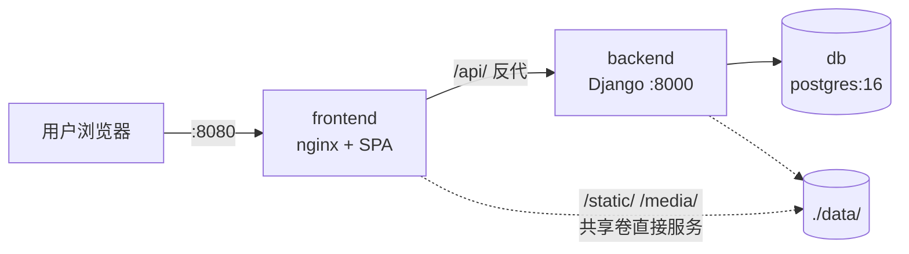

# Riot Hub 架构重构文档：模块化单体（Modular Monolith）

> **文档用途**：本文档是交付给 AI agent 的实施规格书。执行者应按「实施阶段」章节的顺序逐阶段实现，每个阶段有明确的任务清单和验收标准。
>
> **文档状态**：已评审，可实施。
> **最后更新**：2026-07-08
>
> **方案沿革**：早期草案是「每游戏独立前端/后端/DB 镜像 + 独立 compose」的拆分架构，评审后判定对单人维护的项目属于过度设计，已否决，不再考虑。

---

## 1. 背景与目标

### 1.1 现状

当前仓库是一个**直接进入 TFT（云顶之弈）阵容管理**的单体应用：

- `frontend/`：Vue 3 + Vuetify 3 + Vite 7 的 SPA，打包为 nginx 镜像（`wshu7/riot-hub-frontend`），nginx 内部将 `/api/` 反代到后端。首页 `/` 直接就是 TFT 阵容视图，`/settings` 是 TFT 设置页。
- `backend/`：Django 5 + DRF，唯一的业务 app 叫 `core`，提供 Season / TeamComposition 两组 REST API（挂在 `/api/` 根下），打包为 Gunicorn 镜像（`wshu7/riot-hub-backend`）。
- 根目录 `docker-compose.yml`：一条命令部署 前端(8080) + 后端(8000) + PostgreSQL 16，数据落在宿主机 `./data/` 目录。
- `.github/workflows/docker-images.yml`：push 到 main 自动递增版本号打 git tag，构建并推送两个镜像到 Docker Hub；PR 只做构建检查；纯文档变更（`*.md`、`docs/*`、`LICENSE`）跳过构建。

### 1.2 目标

将项目重构为 **Hub 型多游戏应用（模块化单体形态）**：

1. 用户打开 app 首先看到 **Hub（游戏选择页）**，可选择 TFT / LOL / VALORANT。
2. 选择 TFT 后进入现在的 TFT 阵容管理应用（功能不变，路由迁移到 `/tft` 下）。
3. LOL 和 VALORANT 当前显示为「敬请期待」的禁用卡片（功能后续迭代）。
4. **保持单前端镜像 + 单后端镜像 + 单 DB 的部署形态**：一个 `docker-compose.yml`、一条 `docker compose up -d`，与现状完全一致。
5. **代码内按游戏文件夹严格隔离**（模块化纪律见 §4.2），保证多游戏并存后代码不互相纠缠、可长期维护。
6. **CI 保持现状不动**：现有 workflow 的行为（自动构建推送 Docker Hub、自动版本号、文档类变更不触发构建）已满足需求。

### 1.3 非目标（明确不做）

- ❌ 不修改 TFT 现有业务功能（赛季管理、阵容上传、拖拽分级、复制阵容码等行为不变）。
- ❌ 不实现 LOL / VALORANT 的实际业务功能（连空的 Django app / 前端路由都不预建，遵循 YAGNI，见 §4.4）。
- ❌ 不做用户体系 / 登录（保持现状：仅 Django admin）。
- ❌ 不拆分镜像、不加 Portal 镜像、不改 compose 结构、不改 CI workflow。
- ❌ 不做 API 版本号（`/api/v1/`）这类当前用不上的分层。

---

## 2. 目标架构总览

### 2.1 运行时拓扑（与现状一致，零变化）



三个容器、一个 compose、镜像名不变（`riot-hub-frontend` / `riot-hub-backend`）、端口不变（8080 / 8000）、数据卷不变（`./data/`）。**部署层面本次重构对用户完全透明**（存量部署有一次性 DB 升级步骤，见 §7）。

### 2.2 路由与 API 命名空间（本次重构的核心变化）

| 层 | 现状 | 目标 |
|---|---|---|
| 前端 `/` | TFT 阵容视图 | **Hub 游戏选择页** |
| 前端 TFT | `/`、`/settings` | `/tft`、`/tft/settings` |
| 前端 LOL / VAL | 无 | 暂无路由（Hub 卡片禁用态） |
| 后端 API | `/api/seasons/`、`/api/images/` | `/api/tft/seasons/`、`/api/tft/images/` |
| 后端未来游戏 | — | `/api/lol/...`、`/api/val/...`（约定，暂不建） |
| Django admin | `/admin/`（后端 8000 端口） | 不变 |
| 媒体/静态 | `/media/`、`/static/` | 不变 |

### 2.3 目标代码结构

```text
riot-hub/
├── .github/workflows/docker-images.yml   # 不变
├── docker-compose.yml                    # 不变
├── .env.production.example               # 不变
├── docs/
│   └── hub-refactor-architecture.md      # 本文档
├── frontend/
│   ├── Dockerfile / nginx.conf / vite.config.mjs   # 均不变
│   └── src/
│       ├── constants/
│       │   ├── games.js                  # 新增：Hub 游戏卡片元数据
│       │   └── settings.js               # 不变（TFT 设置页分区）
│       ├── layouts/
│       │   ├── default.vue               # 改造：极简壳（Hub 页使用）
│       │   └── tft.vue                   # 新增：现 default.vue 整体迁入并适配
│       ├── pages/
│       │   ├── index.vue                 # 改造：Hub 游戏选择页
│       │   └── tft/
│       │       ├── index.vue             # 现 pages/index.vue 迁入
│       │       └── settings.vue          # 现 pages/settings.vue 迁入
│       ├── components/
│       │   ├── hub/                      # 新增：Hub 页组件（游戏卡片）
│       │   └── tft/                      # 不变
│       ├── stores/
│       │   └── tft.js                    # 不变（API 路径前缀除外）
│       └── api/
│           ├── axios.js                  # 不变（baseURL 仍为 /api）
│           ├── comp.js                   # 改造：路径加 /tft 前缀
│           └── season.js                 # 改造：路径加 /tft 前缀
└── backend/
    ├── Dockerfile / entrypoint.sh / requirements.txt   # 均不变
    ├── config/
    │   ├── settings.py                   # INSTALLED_APPS: core → tft
    │   └── urls.py                       # include 路径改为 api/tft/
    └── tft/                              # 现 core/ 整体改名（§5.1）
```

---

## 3. 关键约定（全局）

### 3.1 游戏标识

所有技术标识（前端路由、API 前缀、Django app 名、DB 表前缀、代码目录）统一使用三字母缩写：

| 游戏 | 标识 | 展示名 |
|---|---|---|
| Teamfight Tactics | `tft` | 云顶之弈 / TFT |
| League of Legends | `lol` | 英雄联盟 / LOL |
| VALORANT | `val` | 无畏契约 / VALORANT |

> `val` 与 Riot 官方开发者 API 命名一致（如 `VAL-MATCH-V1`、`/val/content/v1`）。

### 3.2 新增一个游戏的标准动作（约定，供未来参照）

1. 后端：`python manage.py startapp <game>` → 加入 `INSTALLED_APPS` → `config/urls.py` 挂 `path("api/<game>/", include("<game>.urls"))`。表名自动获得 `<game>_` 前缀。
2. 前端：`pages/<game>/` 建路由树 → `layouts/<game>.vue`（如需专属布局）→ `components/<game>/`、`stores/<game>.js` → `constants/games.js` 中将该游戏 `enabled` 置为 `true`。
3. 无需改 compose、Dockerfile、nginx、CI。

---

## 4. 关键设计决策与理由

### 4.1 模块化单体，而非按游戏拆分服务

**决策**：单前端 + 单后端 + 单 DB，游戏之间以代码目录、路由命名空间、Django app 为边界隔离。

**理由**：项目为单人维护、自部署、低流量，按游戏拆分（多镜像、多 compose、Portal 门户、端口规划、跨游戏跳转整页刷新）带来的独立发布/故障隔离/独立扩缩容收益在此场景下无人受益，运维成本却真实存在。单体形态下：部署保持一条命令；依赖升级一次完成；未来加用户体系只做一次；Hub 就是首页路由，游戏间切换是 SPA 内路由跳转。

**代价与接受理由**：任何游戏的改动都会重建整个镜像并重启服务——构建几分钟、重启几秒，在此规模下无感。

### 4.2 模块化纪律（实施与后续迭代都必须遵守的硬规则）

1. **游戏 app / 目录之间禁止互相 import**：`tft` 不得 import `lol`，反之亦然（前后端同理）。
2. **禁止跨游戏外键**：任何 Django model 不得 FK 到另一个游戏 app 的 model。
3. **共享代码单向依赖**：确有需要共享时，后端建 `common` app、前端建 `src/shared/`，只允许「游戏 → common」方向依赖。**本次重构不预建**，第一个真实共享需求出现时再建。
4. **API 严格按游戏命名空间**：每个游戏的所有端点都在 `/api/<game>/` 之下，不允许挂到 `/api/` 根。
5. **DB 表以 Django app 名为前缀**（框架默认行为）：`tft_season`、`tft_teamcomposition`，未来 `lol_*`、`val_*`。不分 schema、不分库。

### 4.3 Django app `core` 改名为 `tft`（含存量数据迁移）

**决策**：将 `backend/core/` 正式改名为 `backend/tft/`，表名随之从 `core_*` 变为 `tft_*`；为存量部署提供一次性 SQL 升级脚本（§7）。

**理由**：`core` 这个名字暗示"共享/核心"，实际内容全是 TFT 业务，保留会永久误导后续开发（尤其是交给 AI agent 迭代时）；且与 §4.2 规则 5 的表前缀约定冲突。改名成本是一次性的三条 SQL（用户只有一个自控的生产部署），收益是永久的命名一致性。

**被否决的替代方案**：在 `AppConfig` 里设 `label = "core"` 保住旧表名——零迁移风险，但 `core_*` 表名与未来 `lol_*` 并存的不一致会永久存在，且 app 目录名与 label 不一致本身就是新的困惑源。

### 4.4 LOL / VALORANT 不预建任何脚手架

**决策**：Hub 页显示三张卡片，LOL / VAL 为禁用态（「敬请期待」）；不建空 Django app、不建前端占位路由。

**理由**：空 app 和"建设中"页面没有任何用户价值，却会进入镜像、参与构建、出现在 admin 和路由表里。§3.2 已把"新增游戏"固化为标准动作，真正开工时照做即可。

### 4.5 Hub 页的游戏列表硬编码在前端常量，不做运行时配置

**决策**：`src/constants/games.js` 硬编码三个游戏的元数据（id、名称、描述、enabled、路由）。

**理由**：拆分架构里 Portal 需要运行时注入 URL 是因为各游戏部署位置不定；单体下游戏就是内部路由，永远随镜像一起发布，`enabled` 状态本质是发布决策，跟代码一起走版本管理最合适。不需要 config.json、不需要 entrypoint 脚本。

### 4.6 compose、Dockerfile、nginx、CI 全部保持不变

现有基础设施已满足全部需求：nginx 的 `/api/` 反代对 `/api/tft/...` 天然生效（前缀匹配）；Vite dev 代理同理；CI 的"文档变更跳过构建 + 自动版本 tag + 推送 latest/版本双 tag"行为不变。**实施时不得改动这些文件**，将变更面压到最小。

---

## 5. 详细设计

### 5.1 后端改造（Phase 1）

#### 5.1.1 app 改名 `core` → `tft`

1. `git mv backend/core backend/tft`（保留历史）。
2. 全量更新引用（实施时以 grep `core` 结果为准，已知清单）：
   - `backend/config/settings.py`：`INSTALLED_APPS` 中 `"core"` → `"tft"`。
   - `backend/tft/apps.py`：`CoreConfig` → `TftConfig`，`name = "core"` → `name = "tft"`。
   - `backend/tft/migrations/*.py`：**所有**迁移文件中的 app 引用——`dependencies = [("core", ...)]` → `("tft", ...)`；FK 字符串引用 `to="core.season"` → `to="tft.season"`（逐文件 grep `core` 确认清零）。
   - `backend/tft/management/commands/set_active_season.py`：`from core.models import ...` → `from tft.models import ...`（如有）。
   - app 内部相对导入（`from .views import ...`）无需改动。
3. **不修改**任何 model 字段、serializer、view 逻辑。

#### 5.1.2 API 命名空间

`backend/config/urls.py`：

```python
urlpatterns = [
    path("admin/", admin.site.urls),
    path("api/tft/", include("tft.urls")),
]
```

`tft/urls.py` 内容不变（router 注册的 `seasons` / `images` 相对路径不变），最终生效路径为 `/api/tft/seasons/`、`/api/tft/images/`。

> 不保留 `/api/seasons/` 旧路径的兼容转发：API 唯一消费方是同仓前端，二者同一镜像批次发布，无独立客户端。

#### 5.1.3 验收（Phase 1）

```bash
cd backend
# 本地起 dev db（backend/docker-compose.yml）后：
python manage.py makemigrations --check --dry-run   # 无待生成迁移（改名不产生新迁移）
python manage.py migrate                             # 全新库上迁移成功，表名为 tft_*
python manage.py test
curl http://localhost:8000/api/tft/seasons/          # 200
curl http://localhost:8000/api/seasons/              # 404
grep -rn "core" backend/ --include="*.py"            # 无业务代码残留引用（注释除外）
```

### 5.2 前端改造（Phase 2）

#### 5.2.1 路由与布局重组

| 动作 | 说明 |
|---|---|
| `git mv frontend/src/pages/index.vue frontend/src/pages/tft/index.vue` | TFT 主视图迁入 `/tft` |
| `git mv frontend/src/pages/settings.vue frontend/src/pages/tft/settings.vue` | TFT 设置页迁入 `/tft/settings` |
| `git mv frontend/src/layouts/default.vue frontend/src/layouts/tft.vue` | TFT 专属布局（含侧边栏、赛季选择器、设置菜单） |
| 新建 `frontend/src/layouts/default.vue` | 极简壳：`<v-app><router-view /></v-app>`，Hub 页使用 |
| 新建 `frontend/src/pages/index.vue` | Hub 游戏选择页 |

TFT 两个页面通过 route block 声明使用 tft 布局（`unplugin-vue-router` + `vite-plugin-vue-layouts-next` 标准机制）：

```vue
<route lang="yaml">
meta:
  layout: tft
</route>
```

`typed-router.d.ts`、`auto-imports.d.ts` 等生成文件由构建自动更新，不手改。

#### 5.2.2 `layouts/tft.vue` 内部导航适配

在迁移后的 TFT 布局中更新（grep `router.push` / `to=` 核对，已知清单）：

- logo 链接 `to="/"` → 保留指向 `/`（语义变为"返回 Hub"），并在旁边或菜单中加明确的「返回 Hub」入口（`mdi-view-grid-outline` 图标 + 文案）。
- `goHome()`：`router.push('/')` → `router.push('/tft')`（"返回阵容"语义）。
- `goSettings()`：`path: '/settings'` → `path: '/tft/settings'`。
- `isSettingsRoute`：`route.path.startsWith('/settings')` → `startsWith('/tft/settings')`。
- `tft.initializeSeason()` 的调用位置随布局迁移，不变——即 Hub 首页**不会**触发 TFT 数据加载，只有进入 `/tft` 才加载。

#### 5.2.3 API 路径前缀

`frontend/src/api/comp.js`、`season.js`：所有请求路径加 `/tft` 前缀（如 `http.get('/seasons/')` → `http.get('/tft/seasons/')`）。`axios.js` 的 `baseURL: '/api'` 不变。`stores/tft.js` 若有直接拼路径处同步更新。

#### 5.2.4 Hub 游戏选择页规格

`constants/games.js`：

```js
export const GAMES = [
  { id: 'tft', name: 'Teamfight Tactics', displayName: '云顶之弈', description: '阵容图管理 · 强度分级 · 阵容码', route: '/tft', enabled: true,  color: '#c8aa6e' },
  { id: 'lol', name: 'League of Legends', displayName: '英雄联盟', description: '敬请期待',                       route: null,   enabled: false, color: '#0ac8b9' },
  { id: 'val', name: 'VALORANT',          displayName: '无畏契约', description: '敬请期待',                       route: null,   enabled: false, color: '#ff4655' },
]
```

`pages/index.vue` + `components/hub/GameCard.vue`：

1. 品牌区：logo（复用 `src/assets/logo.png`）+ 「Riot Hub」标题，居中。
2. 游戏卡片网格：桌面三列、平板两列、手机单列（Vuetify grid）。
3. enabled 卡片：hover 抬升/高亮，点击 `router.push(game.route)`。
4. disabled 卡片：置灰 + 「敬请期待 / Coming Soon」角标，不可点击。
5. 视觉风格与现有 TFT 界面一致（深色、Vuetify 主题），可复用 `assets/background.webp` 做页面背景。

#### 5.2.5 验收（Phase 2）

```bash
cd frontend && npm run lint && npm run build
# dev 联调（后端跑在 8000）：
npm run dev
# 手工核对清单：
# 1. http://localhost:3000/ 显示 Hub 三卡片；TFT 可点，LOL/VAL 置灰
# 2. 点 TFT 进入 /tft，阵容列表/搜索/大图/复制码全部正常
# 3. /tft/settings 两个分区（阵容管理、赛季管理）功能正常，上传/编辑/删除/拖拽分级正常
# 4. TFT 内「返回 Hub」回到 /；「返回阵容」回到 /tft
# 5. 直接刷新 /tft、/tft/settings 不 404（SPA fallback，nginx try_files 已覆盖）
# 6. 浏览器 Network 面板：所有业务请求都打到 /api/tft/**
```

### 5.3 端到端验收（Phase 3）

```bash
cp .env.production.example .env   # 填好变量
docker compose up -d --build
# http://localhost:8080 → Hub；完整走一遍 §5.2.5 的手工清单
# 上传一张阵容图，确认 /media/ 图片可访问（nginx 共享卷链路不受影响）
docker compose exec db sh -c 'psql -U "$POSTGRES_USER" -d "$POSTGRES_DB" -c "\dt"'   # 表名为 tft_*
```

### 5.4 文档更新（Phase 4）

1. 根 `README.md`（保持现有中英双语风格）：
   - 定位改为「Riot Games 多游戏内容管理 Hub（当前支持 TFT，LOL / VALORANT 规划中）」。
   - 「Backend API Expectations」小节的所有端点加 `/tft` 前缀；「Project Structure」更新为 §2.3 结构；「Main User Flows」第一步改为"打开 Hub 选择 TFT"。
   - 新增简短的「Architecture」小节：模块化单体 + 按游戏命名空间的约定（§3.2、§4.2 摘要）。
   - Docker/CI 说明不变（镜像名、发布行为均未变）。
2. 本文档 §7 的升级步骤在发布 release notes 时需要原样附带。

---

## 6. 实施阶段总览

> **给实施 agent 的总体要求**：
> - 在独立分支上实施，按 Phase 分 commit。Phase 1（后端）与 Phase 2（前端）**必须在同一个 PR 合并**——API 路径变更是前后端联动的，分开合会导致 main 上前后端不兼容。
> - **禁止改动**：`docker-compose.yml`、两个 `Dockerfile`、`frontend/nginx.conf`、`frontend/vite.config.mjs`、`.github/workflows/docker-images.yml`、`.env.production.example`、`backend/entrypoint.sh`。
> - 不修改 TFT 业务逻辑；文件移动用 `git mv`。
> - 不手动创建/推送 `v*` git tag（CI 职责）。

| Phase | 内容 | 关键验收 |
|---|---|---|
| 1 | 后端：app 改名 + API 命名空间（§5.1） | `/api/tft/seasons/` 200、`/api/seasons/` 404、全新库 migrate 出 `tft_*` 表 |
| 2 | 前端：Hub 首页 + TFT 迁入 `/tft` + API 前缀（§5.2） | §5.2.5 手工清单全过 |
| 3 | 端到端 compose 验证（§5.3） | 8080 起全链路可用 |
| 4 | README 更新（§5.4） | 无旧路径（`/api/seasons`、`/settings`）残留引用 |

### 最终整体验收清单

- [ ] `docker compose up -d --build` 一条命令起全栈，8080 打开是 Hub 选择页。
- [ ] TFT 全功能与重构前一致（赛季切换、上传、编辑、删除、拖拽分级、复制阵容码、背景图设置）。
- [ ] LOL / VAL 卡片为禁用态，无对应路由、无空 Django app。
- [ ] 所有 TFT API 位于 `/api/tft/**`，DB 表名为 `tft_*`。
- [ ] 全仓 grep 无 `core` app 残留引用、无 `/api/seasons`（不带 tft 前缀）残留。
- [ ] 基础设施文件（compose / Dockerfile / nginx / CI / entrypoint）与 main 分支 diff 为零。
- [ ] 推纯文档 commit 到 main：CI 不构建、不打版本 tag（现有行为，回归确认即可）。

---

## 7. 存量部署升级指引（面向运维/用户，随 release notes 发布）

本次升级包含数据库结构改名，**必须按顺序执行**，不可直接 `pull && up`：

```bash
cd <部署目录>

# 1. 备份（必做）
docker compose exec -T db sh -c 'pg_dump -U "$POSTGRES_USER" "$POSTGRES_DB"' > backup-$(date +%F).sql

# 2. 停应用（db 保持运行）
docker compose stop backend frontend

# 3. 一次性改名 SQL（app core → tft）
docker compose exec -T db sh -c 'psql -U "$POSTGRES_USER" -d "$POSTGRES_DB"' <<'SQL'
BEGIN;
UPDATE django_migrations   SET app       = 'tft' WHERE app       = 'core';
UPDATE django_content_type SET app_label = 'tft' WHERE app_label = 'core';
ALTER TABLE core_season          RENAME TO tft_season;
ALTER TABLE core_teamcomposition RENAME TO tft_teamcomposition;
COMMIT;
SQL

# 4. 拉新镜像并启动（entrypoint 的 migrate 此时会正常空跑）
docker compose pull
docker compose up -d
```

说明：

- 序列/索引/约束保留旧的自动命名（如 `core_season_pkey`），Django 运行时通过内省定位它们，不影响后续迁移，无需处理。
- 媒体文件路径（`media/season/<version>/<filename>`）与 DB 中的引用不含 app 名，不受影响。
- 前端 URL 变化：书签里的 `/`（原 TFT 主页）现在是 Hub 页，点一下 TFT 卡片即可；`/settings` 变为 `/tft/settings`。
- 若第 3 步执行失败，`docker compose start backend frontend` 可原样回滚到旧版本继续使用（旧镜像 + 未改名的库仍然兼容）。
